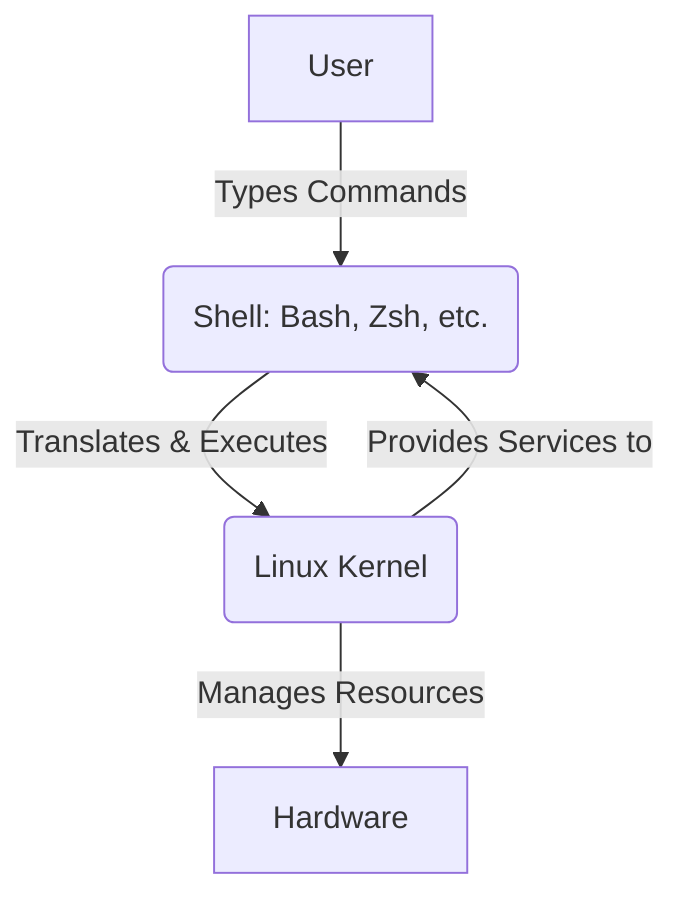
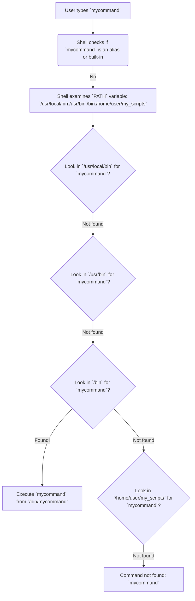

## 1\. What is a Shell?

At its core, a **shell** is a command-line interpreter that provides a user interface for accessing the operating system's services. Think of it as a translator between you and the Linux kernel. When you type commands, the shell interprets them and passes them to the kernel for execution.

### Shell vs. Kernel vs. User

Here's a simplified architecture diagram showing where the shell fits into the overall operating system structure:



  * **User:** You, the person interacting with the computer.
  * **Shell:** The program you use to communicate with the kernel (e.g., `bash`, `zsh`, `sh`, `csh`). It provides the command prompt.
  * **Kernel:** The core of the operating system. It manages the system's resources (CPU, memory, devices) and handles interactions between hardware and software.
  * **Hardware:** The physical components of your computer.

### Bash vs. Zsh Comparison

Bash (Bourne-Again SHell) has been the default shell for most Linux distributions for a long time. Zsh (Z Shell) is a more modern, extended version of Bash, offering powerful features and a highly customizable experience, often enhanced by frameworks like Oh My Zsh.

| Feature         | Bash (Bourne-Again SHell)                               | Zsh (Z Shell)                                                         |
| :-------------- | :------------------------------------------------------ | :-------------------------------------------------------------------- |
| **Origin** | Open-source replacement for the original Bourne Shell.  | Extension of Bash with many improvements.                             |
| **Usability** | Good, but less out-of-the-box features.                | Excellent, especially with frameworks like Oh My Zsh.                 |
| **Popularity** | Very high, default on most Linux distros and macOS (pre-Catalina). | Growing rapidly, default on new macOS versions (Catalina and later). |
| **Customization** | Good, but requires manual setup for advanced features.  | Highly customizable, rich plugin and theme ecosystem.                 |
| **Features** | Basic auto-completion, command history, scripting.       | Advanced auto-completion, smarter history search, spelling correction, shared history, globbing. |
| **Performance** | Generally slightly faster due to fewer features.        | Can be slightly slower with many plugins, but often negligible.       |

-----

**Interview Question:** What's the fundamental difference between a shell and the kernel?

**Best Short-Form Answer:** The **shell** is a user-facing program that interprets commands and allows users to interact with the OS, while the **kernel** is the core of the OS that manages hardware resources and provides fundamental system services.

-----

## 2\. Local vs. Global Environment Variables

**Environment variables** are dynamic named values that store information used by processes or programs. They define the environment in which your shell and other applications run.

  * **Local Variables:** These variables are accessible only within the current shell session or the specific script where they are defined. They are not inherited by child processes.
  * **Global Variables (Environment Variables):** These variables are inherited by all child processes created from the shell where they are defined. They are typically set for system-wide configurations or for specific user sessions.

### Variable Setting Flow Diagram

Understanding how variables are set and made available is crucial. Here's a flow showing common methods:

```mermaid
graph TD
    A[User types `VAR=value`] --> B{Is `export` used?}
    B -- No --> C[Local Variable (Current Shell)]
    B -- Yes --> D[Global Variable (Environment)]
    D --> E[Available to child processes]

    F[`.bashrc` / `.zshrc`] -->|Executed on interactive shell start| G[Sets local/global variables for user session]
    H[`.profile` / `.bash_profile`] -->|Executed on login shell start| G
    I[`/etc/environment`] -->|System-wide variables| J[Set for all users/sessions (non-executable)]
    K[`/etc/profile`] -->|System-wide login shell variables| G
```

  * **`export`:** The `export` command marks a local shell variable to be exported to the environment of subsequent child processes.
  * **`.bashrc` / `.zshrc`:** These are shell configuration files executed every time a **new interactive non-login shell** starts. They are ideal for setting user-specific aliases, functions, and path modifications that you want available in every new terminal window.
  * **`.bash_profile` / `.profile`:**
      * **`.bash_profile`:** Executed when Bash is started as a **login shell** (e.g., when you log in to a text console or via SSH). It's typically used for commands that should only run once at login.
      * **`.profile`:** A more general login shell script, used by `sh` and other shells. If `.bash_profile` doesn't exist, Bash will look for `.profile`.
      * **When they are executed:**
          * **Login Shell:** When you log in (physically or via SSH), a login shell starts, executing `.bash_profile` (or `.profile`).
          * **Interactive Non-Login Shell:** When you open a new terminal window or tab within an existing graphical session, an interactive non-login shell starts, executing `.bashrc`.

### Real-time Use Case: Setting `JAVA_HOME` or `PATH`

Let's say you need to set the `JAVA_HOME` environment variable for your Java development projects or modify your `PATH` to include a custom script directory.

**Scenario: Setting `JAVA_HOME` for a specific project**

1.  **Temporarily (Current Session Only):**

    ```bash
    export JAVA_HOME="/usr/lib/jvm/java-11-openjdk-amd64"
    echo $JAVA_HOME
    ```

      * This sets `JAVA_HOME` for the current terminal session and any processes launched from it. It's lost when you close the terminal.

2.  **Permanently (User-specific):**
    Edit your `~/.bashrc` (for Bash) or `~/.zshrc` (for Zsh):

    ```bash
    # Add to the end of ~/.bashrc or ~/.zshrc
    export JAVA_HOME="/usr/lib/jvm/java-11-openjdk-amd64"
    export PATH="$PATH:$JAVA_HOME/bin" # Also add Java's bin to PATH
    ```

    After saving, apply changes: `source ~/.bashrc` or `source ~/.zshrc`.

      * This makes `JAVA_HOME` available every time you open a new interactive shell.

### Visualize Shell Session Lifecycle with Variables

```mermaid
graph TD
    A[User Logs In (Login Shell)] --> B{Reads ~/.bash_profile or ~/.profile}
    B --> C[Sets Login-specific Global Variables]
    C --> D[Opens New Terminal (Interactive Non-Login Shell)]
    D --> E{Reads ~/.bashrc or ~/.zshrc}
    E --> F[Sets Session-specific Global/Local Variables]
    F --> G[Commands Executed in Shell]
    G --> H{Child Process Launched}
    H --> I[Inherits Global Variables from Parent Shell]
    I --> J[Local Variables are NOT Inherited]
    F --> K[Session Ends / Terminal Closed]
    K --> L[Local/Session Global Variables are Lost]
```

-----

**Interview Question:** When would you use `.bashrc` versus `.bash_profile`?

**Best Short-Form Answer:** Use `.bashrc` for commands and configurations you want to run every time you open a **new interactive non-login shell** (like a new terminal tab). Use `.bash_profile` for commands that should run only once when you **log in** to your system.

-----

## 3\. Useful Shell Shortcuts

Shell shortcuts are productivity boosters\! They help you navigate, edit, and re-execute commands much faster.

### Keyboard Shortcut Cheat Sheet

| Shortcut       | Description                                  | Use Case Example                                |
| :------------- | :------------------------------------------- | :---------------------------------------------- |
| `Ctrl+C`       | Terminate/kill the foreground process.       | Stop a running `ping` command or an infinite loop. |
| `Ctrl+L`       | Clear the screen.                            | Quickly clear clutter from your terminal.       |
| `!!`           | Execute the last command.                    | Forgot `sudo`? `sudo !!`                        |
| `!$`           | Last argument of the previous command.       | `mkdir my_project`; `cd !$` (cd my\_project)    |
| `Tab`          | Command/filename completion.                 | `cd Do<Tab>` (completes to `Documents/`)        |
| `Ctrl+R`       | Reverse history search.                      | Search for a command you used previously, e.g., `Ctrl+R` then type `ssh`. |
| `Ctrl+A`       | Move cursor to the beginning of the line.    | Quickly jump to the start to add `sudo`.        |
| `Ctrl+E`       | Move cursor to the end of the line.          | Quickly jump to the end to append arguments.    |
| `Ctrl+U`       | Delete from cursor to the beginning of the line. | Clear current input quickly.                    |
| `Ctrl+K`       | Delete from cursor to the end of the line.   | Remove trailing arguments.                      |
| `Ctrl+W`       | Delete the word before the cursor.           | Remove a mistyped argument.                     |
| `Alt+F`        | Move cursor forward one word.                | Navigate quickly across a long command.         |
| `Alt+B`        | Move cursor backward one word.               | Navigate quickly across a long command.         |

### How History Search (`Ctrl+R`) and Tab-Completion (`Tab`) Help Productivity

  * **`Ctrl+R` (Reverse History Search):** Imagine you ran a complex `grep` command a while ago and need to run it again, but you don't remember the exact syntax. Instead of scrolling endlessly through history, `Ctrl+R` allows you to type a part of the command, and Bash/Zsh will search backward through your history to find matching entries. Press `Ctrl+R` repeatedly to cycle through matches. This is a massive time-saver for frequently used or long commands.

    ```
    (reverse-i-search)`grep`: grep -r "error" /var/log/apache2/
    ```

  * **`Tab` (Tab Completion):** This is arguably the most used and loved shell feature.

      * **Command Completion:** Type the first few letters of a command and press `Tab`. If there's only one match, it completes it. If there are multiple, it shows you the options.
      * **Filename/Directory Completion:** When you're typing file paths, `Tab` completion saves you from typing long, error-prone names. It also prevents typos.
      * **Argument Completion:** Many commands (especially in Zsh) support argument completion, helping you with options or values for flags.

    <!-- end list -->

    ```
    $ cd Doc<Tab>  -->  $ cd Documents/
    $ ls -l /var/lo<Tab> --> $ ls -l /var/log/
    $ git chec<Tab><Tab> --> shows 'checkout', 'cherry-pick' etc.
    ```

These features significantly reduce typing, minimize errors, and allow you to recall complex commands effortlessly, boosting your overall command-line productivity.

-----

**Interview Question:** How can you quickly re-run a command you just executed but with `sudo` at the beginning?

**Best Short-Form Answer:** You can use `sudo !!`. The `!!` expands to the last command executed in the shell.

-----

## 4\. Understanding the PATH

The **PATH** is an environment variable that tells your shell where to look for executable programs when you type a command. It's a colon-separated list of directories.

### What the PATH Variable Does

When you type a command like `ls` or `python` at your terminal, the shell doesn't immediately know where the `ls` or `python` executable file is located. Instead, it consults the `PATH` variable. It goes through each directory listed in `PATH`, from left to right, looking for an executable file with that name. The first one it finds is the one it executes.

### How the Shell Searches the PATH



**Example:** If your `PATH` is `/usr/local/bin:/usr/bin:/bin`, and you type `python`, the shell will:

1.  Look for `python` in `/usr/local/bin`.
2.  If not found, look for `python` in `/usr/bin`.
3.  If not found, look for `python` in `/bin`.
4.  If still not found, it will report "command not found."

You can view your current `PATH` with:

```bash
echo $PATH
# Example output: /usr/local/sbin:/usr/local/bin:/usr/sbin:/usr/bin:/sbin:/bin:/snap/bin:/home/user/.local/bin
```

### How to Add a New Path Temporarily and Permanently

Often, you'll install software or write scripts that aren't in the default `PATH` directories.

1.  **Temporarily (Current Session Only):**
    This is useful for testing or for scripts that only need to be run once in a specific session.

    ```bash
    export PATH="/path/to/your/new/directory:$PATH"
    # Example: Add a custom scripts directory
    export PATH="/home/youruser/bin:$PATH"
    ```

      * **Explanation:** We append (or prepend, depending on preference) the new directory to the existing `PATH`. Prepending means it will be searched first, which can be useful if you have custom versions of commands.
      * **Verification:** `echo $PATH` to see the updated path.

2.  **Permanently (User-specific):**
    For paths you want to be available every time you open a terminal.
    Edit your `~/.bashrc` (for Bash) or `~/.zshrc` (for Zsh) and add the `export` line:

    ```bash
    # Add this line to ~/.bashrc or ~/.zshrc
    export PATH="$PATH:/home/youruser/my_custom_tools"
    # Or to prioritize:
    # export PATH="/home/youruser/my_custom_tools:$PATH"
    ```

    After saving the file, you need to "source" it to apply the changes to your current session, or simply open a new terminal.

    ```bash
    source ~/.bashrc # Or source ~/.zshrc
    ```

3.  **Permanently (System-wide - For All Users):**
    This is for tools that all users on the system need access to. Be cautious when modifying these files.

      * Add to `/etc/environment`: This file is read at system startup and sets system-wide environment variables. It's a simple key-value file, not a script.
        ```
        PATH="/usr/local/sbin:/usr/local/bin:/usr/sbin:/usr/bin:/sbin:/bin:/home/youruser/my_custom_tools"
        ```
          * **Important:** You need to reboot or log out and back in for changes here to take effect.
      * Add to `/etc/profile` or a file in `/etc/profile.d/`: These are executed for all login shells. Adding a new `.sh` file in `/etc/profile.d/` is often preferred for better organization.
        ```bash
        # Create a new file, e.g., /etc/profile.d/custom_path.sh
        export PATH="$PATH:/opt/new_application/bin"
        ```
          * Changes take effect on the next login.

### Real-world Mistakes (Like Not Adding `bin/` Folders Properly)

A common mistake is adding the parent directory of an application instead of its `bin` subdirectory to the `PATH`.

**Example:** Installing a tool like `maven` or `gradle`.

  * You download it to `/opt/apache-maven-3.9.6`.
  * The executable `mvn` is located at `/opt/apache-maven-3.9.6/bin/mvn`.

**Incorrect `PATH` addition:**

```bash
export PATH="$PATH:/opt/apache-maven-3.9.6" # Incorrect!
# When you type 'mvn', the shell won't find it here because it's not in the root of that directory.
```

**Correct `PATH` addition:**

```bash
export PATH="$PATH:/opt/apache-maven-3.9.6/bin" # Correct!
# Now, when you type 'mvn', the shell will find it in the 'bin' directory.
```

**Verification:** After modifying `PATH`, always run `echo $PATH` and then try to execute the command you expect to be found. If it still says "command not found," use `which <command>` (e.g., `which mvn`) to see if the shell can locate it. If `which` doesn't find it, your `PATH` is likely misconfigured.

-----

**Interview Question:** What happens if two different executables with the same name exist in two different directories listed in your `PATH`?

**Best Short-Form Answer:** The shell executes the first one it finds in the `PATH` based on the order of directories. The directory listed earliest in the `PATH` takes precedence.
