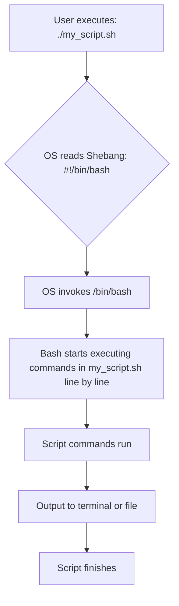
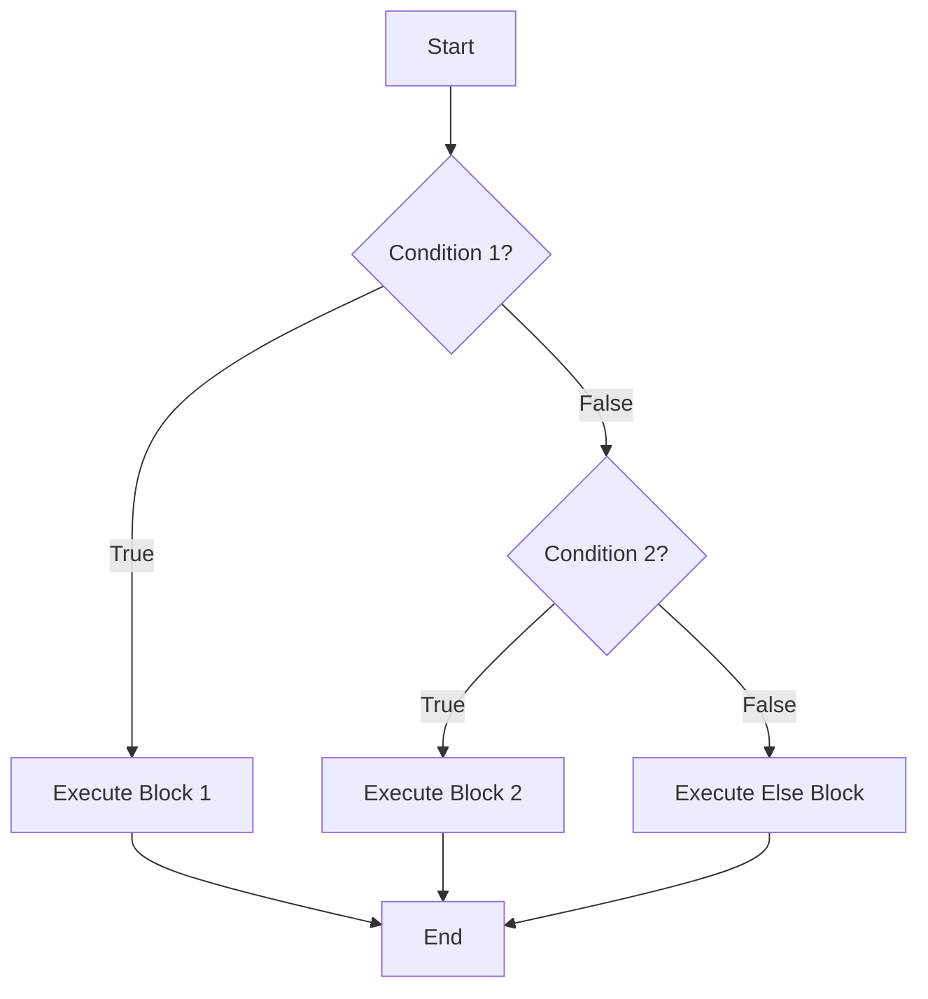
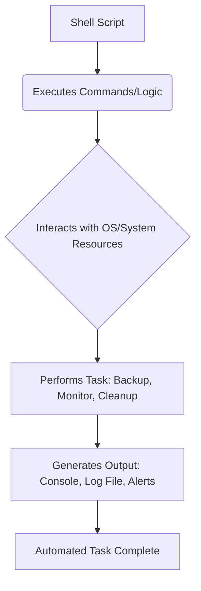

# 🛠️ Mastering Shell Scripting in Linux (Beginner to Advanced) — Visual & Practical Approach

Welcome\! This guide will take you through the fundamentals and advanced concepts of shell scripting, using a visual and practical approach, perfect for automating tasks and enhancing your Linux skills.

-----

## 1\. ✍️ Writing Your First Bash Script

A **shell script** is a sequence of commands written in a plain text file that the shell can execute. Think of it as a batch file for Linux/Unix systems, automating tasks you'd normally type one by one.

### What is a `.sh` file?

A `.sh` file is simply a conventional extension for shell script files, indicating they contain shell commands. However, the extension is not mandatory for execution.

### Diagram: Script Execution Flow

The first line in many shell scripts, `#!/bin/bash`, is called a **shebang**. It tells the operating system which interpreter to use to execute the script (in this case, `bash`).



### Sample: `echo "Hello, World!"` + How to Run

1.  **Create the script file:**

    ```bash
    # nano hello.sh
    ```

    (Or `vim`, `gedit`, VS Code, etc.)

2.  **Add the script content:**

    ```bash
    #!/bin/bash
    # This is my first Bash script
    echo "Hello, World from my first script!"
    ```

3.  **Make it executable:**
    By default, newly created files are not executable. You need to grant execute permissions.

    ```bash
    # Terminal
    $ ls -l hello.sh
    -rw-rw-r-- 1 user user 57 Jun 21 18:30 hello.sh

    $ chmod +x hello.sh

    $ ls -l hello.sh
    -rwxrwxr-x 1 user user 57 Jun 21 18:30 hello.sh
    # 'x' now appears, indicating executable permission
    ```

4.  **Run the script:**

    ```bash
    # Terminal
    $ ./hello.sh
    Hello, World from my first script!
    ```

      * `./` is crucial. It tells the shell to look for the script in the current directory, as the current directory (`.`) is usually not in your `PATH` for security reasons.

-----

**Interview Question:** Why is `chmod +x` important for a shell script, and what does the shebang line (`#!/bin/bash`) do?

**Best Short-Form Answer:** `chmod +x` makes the script executable, allowing the OS to run it. The shebang line specifies the interpreter (e.g., `/bin/bash`) that should be used to execute the script, ensuring it runs correctly even if you invoke it without explicitly stating the interpreter (e.g., `./script.sh` instead of `bash script.sh`).

-----

## 2\. 📦 Variables & Operators

Variables are used to store data, making scripts dynamic and reusable.

### Visual Guide: Declaring, Assigning, Using Variables

```mermaid
graph TD
    A[Declaration & Assignment] --> B[my_variable="Hello Bash"]
    B --> C{Rules: No spaces around = sign}
    C --> D[Accessing Variable]
    D --> E[echo $my_variable]
    E --> F[Output: Hello Bash]
    F --> G[Reassignment]
    G --> H[my_variable="New Value"]
    H --> I[echo $my_variable]
    I --> J[Output: New Value]
```

**Code Example:**

```bash
#!/bin/bash

# --- Variable Declaration and Assignment ---
# No spaces around the '=' sign!
GREETING="Hello, Shell Scripting!"
USERNAME=$(whoami) # Command substitution: output of 'whoami' stored

# --- Accessing Variables ---
echo "$GREETING"      # Output: Hello, Shell Scripting!
echo "Current user is: $USERNAME" # Output: Current user is: your_username

# --- Reassignment ---
GREETING="Welcome back, $USERNAME!"
echo "$GREETING"      # Output: Welcome back, your_username!

# --- Read user input ---
echo "Enter your favorite color:"
read FAV_COLOR
echo "Your favorite color is: $FAV_COLOR"
```

### Diagram: Arithmetic & String Operations

Bash primarily treats variables as strings. For arithmetic operations, you need specific constructs.

```mermaid
graph TD
    A[Variable A=10, B=5] --> B{Arithmetic Operations}
    B --> C[Result=$((A + B))]
    C --> D[Result=$((A - B))]
    D --> E[Result=$((A * B))]
    E --> F[Result=$((A / B))]
    F --> G[Result=$((A % B))]

    H[String S1="Hello", S2="World"] --> I{String Operations}
    I --> J[Concatenation: ${S1}${S2}]
    J --> K[Length: ${#S1}]
    K --> L[Substring: ${S1:0:3}]
```

**Code Examples:**

```bash
#!/bin/bash

# --- Arithmetic Operations ---
NUM1=10
NUM2=5

SUM=$((NUM1 + NUM2)) # Sum = 15
SUB=$((NUM1 - NUM2)) # Sub = 5
MUL=$((NUM1 * NUM2)) # Mul = 50
DIV=$((NUM1 / NUM2)) # Div = 2
MOD=$((NUM1 % NUM2)) # Mod = 0

echo "Sum: $SUM"
echo "Difference: $SUB"
echo "Product: $MUL"
echo "Quotient: $DIV"
echo "Modulus: $MOD"

# Another way for arithmetic (older syntax)
let "ANOTHER_SUM = $NUM1 + $NUM2"
echo "Another sum: $ANOTHER_SUM"

# --- String Operations ---
FIRST_NAME="John"
LAST_NAME="Doe"
FULL_NAME="${FIRST_NAME} ${LAST_NAME}" # Concatenation

echo "Full Name: $FULL_NAME"      # Output: John Doe
echo "Length of First Name: ${#FIRST_NAME}" # Output: 4

# Substring (start_index:length)
PART_OF_NAME="${FULL_NAME:0:4}" # "John"
echo "Part of Name: $PART_OF_NAME"
```

### Real Use: Storing User Input or System Info

  * **User Input:** Scripts often need interactive input from the user.

    ```bash
    #!/bin/bash
    echo "Please enter your name:"
    read USER_NAME
    echo "Hello, $USER_NAME! Welcome to the script."
    ```

  * **System Information:** Storing command output in variables is fundamental for automation.

    ```bash
    #!/bin/bash
    CURRENT_DATE=$(date +"%Y-%m-%d") # Store current date
    FREE_SPACE_KB=$(df -k / | awk 'NR==2 {print $4}') # Free space on root in KB

    echo "Today's date: $CURRENT_DATE"
    echo "Free space on root: $FREE_SPACE_KB KB"
    ```

-----

**Interview Question:** What's the significance of using `$` before a variable name when accessing its value, and why are spaces not allowed around the `=` sign during variable assignment?

**Best Short-Form Answer:** The `$` sign is used for **variable expansion**, telling the shell to substitute the variable's name with its stored value. Spaces around the `=` sign are disallowed during assignment because the shell would interpret the variable name as a command and the `=` sign as an argument, leading to a "command not found" error.

-----

## 3\. 🔁 Conditional Statements (if, else, elif)

Conditional statements allow your script to make decisions based on certain conditions, enabling dynamic behavior.

### Diagram: Decision-Making Tree



### Visual Examples

Bash uses `[ ]` or `[[ ]]` for conditional expressions. `[[ ]]` is generally preferred as it's more flexible and safer.

  * **File existence check (`if [ -f filename ]`)**

    ```bash
    #!/bin/bash

    FILE_PATH="/tmp/my_temp_file.txt"

    # Create file for demonstration
    touch "$FILE_PATH"

    echo "--- File Existence Check ---"
    if [ -f "$FILE_PATH" ]; then
        echo "File '$FILE_PATH' exists and is a regular file."
    else
        echo "File '$FILE_PATH' does NOT exist or is not a regular file."
    fi

    # Clean up
    rm "$FILE_PATH"
    ```

  * **String comparison**

    ```bash
    #!/bin/bash

    echo "--- String Comparison ---"
    USER_ROLE="admin"

    if [[ "$USER_ROLE" == "admin" ]]; then
        echo "Access granted: You are an administrator."
    elif [[ "$USER_ROLE" == "user" ]]; then
        echo "Access granted: You are a regular user."
    else
        echo "Access denied: Unknown role."
    fi

    # Output: Access granted: You are an administrator.
    ```

      * `==` for equality. `!=` for inequality. `<` and `>` for lexical (alphabetical) comparison within `[[ ]]`.

  * **Number comparison**

    ```bash
    #!/bin/bash

    echo "--- Number Comparison ---"
    TEMPERATURE=25

    if (( TEMPERATURE > 30 )); then # '(( ))' for arithmetic evaluation
        echo "It's hot outside!"
    elif (( TEMPERATURE >= 20 && TEMPERATURE <= 30 )); then
        echo "It's pleasant."
    else
        echo "It's cold."
    fi

    # Output: It's pleasant.
    ```

      * **Operators for `[ ]` (or `test`):**
          * `-eq` (equal)
          * `-ne` (not equal)
          * `-gt` (greater than)
          * `-ge` (greater than or equal)
          * `-lt` (less than)
          * `-le` (less than or equal)
      * **Operators for `(( ))` (arithmetic expansion):**
          * `>`, `<`, `>=`, `<=`, `==`, `!=` (standard C-like operators)

-----

**Interview Question:** What are the main differences between `[ ]` and `[[ ]]` for conditional expressions in Bash?

**Best Short-Form Answer:** `[ ]` is a synonym for the `test` command, behaving more like a traditional command, requiring careful quoting. `[[ ]]` is a Bash keyword that provides more advanced features like pattern matching, allows logical operators (`&&`, `||`) without escaping, and is generally safer and more flexible, making it the preferred choice for modern scripts.

-----

## 4\. 🔂 Loops in Bash (for, while, until)

Loops allow you to execute a block of code multiple times, crucial for automation.

### ASCII Loop Flow

  * **`for` loop (Iterating through items)**

    ```
    +-----------------+
    |  for item in    |
    |  list_of_items  |
    +-----------------+
            |
            v
    +-------------------+
    | Is there another  |
    | item in the list? |
    +-------------------+
            | YES
            v
    +-------------------+
    | Execute commands  |
    | with current item |
    +-------------------+
            |
            v
    +-------------------+
    |   Go to next item |
    +-------------------+
            | NO
            v
    +-----------------+
    |   Loop Ends     |
    +-----------------+
    ```

    **Example:** Iterating through files

    ```bash
    #!/bin/bash
    echo "--- Processing Files in Current Directory ---"
    for file in *; do
        if [ -f "$file" ]; then # Process only regular files
            echo "Processing file: $file (size: $(du -sh "$file" | awk '{print $1}'))"
        fi
    done
    ```

  * **`while` loop (Looping while a condition is true)**

    ```
    +-----------------+
    | Start           |
    +-----------------+
            |
            v
    +-------------------+
    | Is condition TRUE?|
    +-------------------+
            | YES
            v
    +-------------------+
    | Execute commands  |
    | (Update condition)|
    +-------------------+
            |
            v
    +-------------------+
    |   Go back to      |
    |   check condition |
    +-------------------+
            | NO
            v
    +-----------------+
    |   Loop Ends     |
    +-----------------+
    ```

    **Example:** Counting down

    ```bash
    #!/bin/bash
    echo "--- Countdown ---"
    COUNT=5
    while [ "$COUNT" -gt 0 ]; do
        echo "$COUNT..."
        sleep 1 # Wait for 1 second
        COUNT=$((COUNT - 1))
    done
    echo "Blast off!"
    ```

  * **`until` loop (Looping until a condition is true)**

    ```
    +-----------------+
    | Start           |
    +-----------------+
            |
            v
    +-------------------+
    | Is condition TRUE?|
    +-------------------+
            | NO
            v
    +-------------------+
    | Execute commands  |
    | (Update condition)|
    +-------------------+
            |
            v
    +-------------------+
    |   Go back to      |
    |   check condition |
    +-------------------+
            | YES
            v
    +-----------------+
    |   Loop Ends     |
    +-----------------+
    ```

    **Example:** Wait for a file to appear

    ```bash
    #!/bin/bash
    echo "--- Waiting for file ---"
    TARGET_FILE="/tmp/data_ready.txt"
    echo "Waiting for $TARGET_FILE to appear..."

    until [ -f "$TARGET_FILE" ]; do
        echo "Still waiting... (Press Ctrl+C to stop)"
        sleep 2
    done

    echo "File '$TARGET_FILE' found! Proceeding with script."
    # Now you can process the file
    ```

      * (You can test this by running the script in one terminal and `touch /tmp/data_ready.txt` in another).

### Real Automation Use

  * **Loop through backups:** Automate the processing of backup files.

    ```bash
    #!/bin/bash
    BACKUP_DIR="/var/backups/daily"
    echo "--- Processing Daily Backups ---"
    for backup_file in "$BACKUP_DIR"/*.tar.gz; do
        if [ -f "$backup_file" ]; then
            echo "Archiving old backup: $backup_file"
            # Example: Move backups older than 7 days to an 'archive' subfolder
            # find "$BACKUP_DIR" -maxdepth 1 -name "*.tar.gz" -mtime +7 -exec mv {} "$BACKUP_DIR/archive/" \;
        fi
    done
    echo "Backup processing complete."
    ```

  * **Log file processing:** Analyze multiple log files for specific patterns.

    ```bash
    #!/bin/bash
    LOG_DIR="/var/log"
    ERROR_KEYWORD="ERROR"

    echo "--- Searching for '$ERROR_KEYWORD' in log files ---"
    for log_file in "$LOG_DIR"/*.log; do
        if [ -f "$log_file" ]; then
            echo "Checking $log_file..."
            grep -q "$ERROR_KEYWORD" "$log_file"
            if [ $? -eq 0 ]; then # Check if grep found anything (exit code 0 = found)
                echo "  -> Found errors in $log_file!"
                grep "$ERROR_KEYWORD" "$log_file" | head -n 5 # Show first 5 errors
            fi
        fi
    done
    ```

  * **System cleanup:** Remove old temporary files.

    ```bash
    #!/bin/bash
    TEMP_DIR="/tmp"
    DAYS_OLD=7

    echo "--- Cleaning up old files in $TEMP_DIR (older than $DAYS_OLD days) ---"
    find "$TEMP_DIR" -type f -mtime +"$DAYS_OLD" -delete -print
    echo "Cleanup complete."
    ```

-----

**Interview Question:** When would you choose a `while` loop over a `for` loop in shell scripting?

**Best Short-Form Answer:** Use a `for` loop when you have a **fixed list of items** to iterate through (e.g., files, strings). Use a `while` loop when you need to loop **as long as a certain condition remains true**, especially when the number of iterations is not known beforehand or depends on dynamic conditions (e.g., waiting for a file, reading line by line from input).

-----

## 5\. 🔧 Functions in Bash

Functions allow you to group commands into reusable blocks, improving script organization, readability, and maintainability.

### Visual Syntax

```bash
# Style 1: Keyword 'function' (recommended for clarity)
function my_function_name {
    # Commands inside the function
    echo "This is inside my_function_name."
    local var_in_function="Only visible here" # Local variables
    echo "$1" # Accessing first argument to the function
}

# Style 2: No 'function' keyword
another_function_name() {
    # Commands
    echo "This is inside another_function_name."
}

# Calling a function
# my_function_name "Hello"
# another_function_name
```

### Use-case: Modularize scripts for maintainability

Imagine a complex script with multiple logical sections (e.g., setup, execution, cleanup). Functions help break it down.

```bash
#!/bin/bash
# mysystem_deploy.sh

# --- Function Definitions ---
function setup_environment {
    echo "Setting up environment..."
    # Perform tasks like checking dependencies, creating directories
    mkdir -p /opt/myapp_data
    echo "Environment setup complete."
}

function deploy_application {
    echo "Deploying application..."
    # Copy application files, configure services
    cp -r ./src/* /opt/myapp_data/
    echo "Application deployed."
}

function start_service {
    echo "Starting application service..."
    # Start systemd service or background process
    # systemctl start myapp.service
    echo "Service started."
}

function cleanup_logs {
    echo "Cleaning up temporary logs..."
    # Remove old logs or temp files
    find /var/log/myapp -name "*.tmp" -delete
    echo "Log cleanup complete."
}

# --- Main Script Logic ---
echo "--- Starting My System Deployment Script ---"

setup_environment
deploy_application
start_service
cleanup_logs

echo "--- Deployment Complete! ---"
```

This structure makes the script easier to read, debug, and expand. If "setup environment" changes, you only modify that function.

### Show real-world function (e.g., check system status)

```bash
#!/bin/bash

# Function to check disk usage
function check_disk_usage {
    echo "--- Disk Usage Report ---"
    df -h / | awk 'NR==2 {print "Disk Usage on /: "$5}'
    echo "-------------------------"
}

# Function to check memory usage
function check_memory_usage {
    echo "--- Memory Usage Report ---"
    free -h | awk 'NR==2 {print "Total: "$2", Used: "$3", Free: "$4}'
    echo "-------------------------"
}

# Function to check running processes (top 5 by CPU)
function check_top_processes {
    echo "--- Top 5 CPU Processes ---"
    ps aux --sort=-%cpu | head -n 6
    echo "---------------------------"
}

# Main execution
echo "--- System Status Report ($(date)) ---"
check_disk_usage
check_memory_usage
check_top_processes
echo "--- Report End ---"
```

-----

**Interview Question:** What are `local` variables in Bash functions, and why are they important?

**Best Short-Form Answer:** `local` variables are variables declared within a Bash function using the `local` keyword. They are important because they are scoped only to that function, preventing name collisions with variables outside the function (global variables) and making functions self-contained and safer to reuse without unintended side effects.

-----

## 6\. 📤 Script Arguments (`$1`, `$@`, `$#`, `$?`)

Shell scripts can accept arguments from the command line, making them flexible and powerful for automation.

### Visual Table of Argument Variables

| Variable | Description                                                     | Example Usage (`./script.sh arg1 arg2`) | Output       |
| :------- | :-------------------------------------------------------------- | :-------------------------------------- | :----------- |
| `$0`     | Name of the script itself.                                      | `echo "$0"`                             | `./script.sh`|
| `$1`, `$2`, ... | Individual arguments passed to the script.                    | `echo "$1"`                             | `arg1`       |
| `$#`     | The number of arguments passed to the script.                   | `echo "$#"`                             | `2`          |
| `$*`     | All arguments as a single string (separated by IFS).            | `echo "$*"`                             | `arg1 arg2`  |
| `$@`     | All arguments as separate strings (best for loops).             | `for a in "$@"; do echo "$a"; done`     | `arg1` `arg2`|
| `$?`     | The exit status of the last executed command. (`0` for success).| `ls non_existent_file; echo "$?"`      | `2` (or non-zero) |

### Use-case: CLI Automation Scripts

Let's create a script that can create a directory and optionally change into it, taking arguments.

```bash
#!/bin/bash
# create_and_cd.sh

# Check if at least one argument is provided (directory name)
if [ "$#" -eq 0 ]; then
    echo "Usage: $0 <directory_name> [cd_into_it]"
    echo "  Example: $0 my_project (creates directory)"
    echo "  Example: $0 my_project cd (creates and changes into directory)"
    exit 1 # Exit with an error code
fi

DIR_NAME="$1" # First argument is the directory name
CHANGE_DIR_FLAG="$2" # Second argument (optional)

echo "--- Creating Directory ---"
mkdir -p "$DIR_NAME" # -p creates parent directories if needed

if [ $? -eq 0 ]; then # Check exit status of mkdir
    echo "Directory '$DIR_NAME' created successfully."

    if [[ "$CHANGE_DIR_FLAG" == "cd" ]]; then
        echo "Changing into '$DIR_NAME'..."
        cd "$DIR_NAME" || { echo "Failed to change directory."; exit 1; }
        echo "Current directory: $(pwd)"
    fi
else
    echo "Failed to create directory '$DIR_NAME'."
    exit 1 # Exit with an error
fi

echo "Script finished."
```

### Flowchart: How a script behaves with/without arguments

```mermaid
graph TD
    A[Start Script: my_script.sh [args]] --> B{Is $# equal to 0?}
    B -- Yes --> C[Display Usage Message]
    C --> D[Exit with Error (e.g., 1)]

    B -- No --> E[Read arguments: $1, $2, etc.]
    E --> F[Process logic based on arguments]
    F --> G[Execute commands]
    G --> H[Check exit status ($?) of commands]
    H -- Success (0) --> I[Continue processing / Output Success]
    H -- Failure (non-zero) --> J[Handle Error / Output Failure]
    I --> K[Script Ends Successfully (exit 0)]
    J --> D
```

-----

**Interview Question:** What is the difference between `$*` and `$@` in shell scripting, and when would you use each?

**Best Short-Form Answer:** When unquoted, `$*` and `$@` are identical. However, when **quoted**:

  * `"$*"` expands all arguments into a **single string**, with elements separated by the first character of `IFS` (Internal Field Separator). This is rarely desired.
  * `"$@"` expands each argument into a **separate, individually quoted string**. This is almost always what you want when iterating through arguments in a `for` loop, as it preserves spaces within arguments.

-----

## 7\. 🤖 Automating Tasks with Scripts

Shell scripting excels at automating repetitive administrative and development tasks.

### Examples:

  * **Auto Backup Script:**
    This script compresses a specified directory and stores it with a timestamp.

    ```bash
    #!/bin/bash
    # auto_backup.sh <source_directory> <destination_directory>

    SOURCE_DIR="$1"
    DEST_DIR="$2"
    TIMESTAMP=$(date +"%Y%m%d_%H%M%S")
    BACKUP_FILENAME="backup_${TIMESTAMP}.tar.gz"

    if [ -z "$SOURCE_DIR" ] || [ -z "$DEST_DIR" ]; then
        echo "Usage: $0 <source_directory> <destination_directory>"
        exit 1
    fi

    if [ ! -d "$SOURCE_DIR" ]; then
        echo "Error: Source directory '$SOURCE_DIR' does not exist."
        exit 1
    fi

    mkdir -p "$DEST_DIR" || { echo "Error: Could not create destination directory."; exit 1; }

    echo "--- Starting Backup of '$SOURCE_DIR' ---"
    tar -czf "$DEST_DIR/$BACKUP_FILENAME" "$SOURCE_DIR"

    if [ $? -eq 0 ]; then
        echo "Backup successful: $DEST_DIR/$BACKUP_FILENAME"
        echo "Cleanup: Keeping only the last 7 backups..."
        find "$DEST_DIR" -maxdepth 1 -name "backup_*.tar.gz" -mtime +7 -delete
    else
        echo "Backup failed!"
    fi
    ```

      * **Usage:** `./auto_backup.sh /home/user/mydata /mnt/backups`

  * **System Monitor Script:**
    Periodically checks system resources and logs them.

    ```bash
    #!/bin/bash
    # sys_monitor.sh <log_file> <interval_seconds>

    LOG_FILE="${1:-/var/log/sys_monitor.log}" # Default to /var/log/sys_monitor.log if no arg
    INTERVAL="${2:-5}" # Default to 5 seconds if no arg

    echo "--- System Monitoring Started ---" | tee -a "$LOG_FILE"
    echo "Logging to: $LOG_FILE every $INTERVAL seconds." | tee -a "$LOG_FILE"

    while true; do
        CURRENT_TIME=$(date +"%Y-%m-%d %H:%M:%S")
        CPU_USAGE=$(top -bn1 | grep "Cpu(s)" | awk '{print $2 + $4}')
        MEM_USAGE=$(free -m | awk 'NR==2 {print $3/$2*100.0}')
        DISK_USAGE=$(df -h / | awk 'NR==2 {print $5}')

        echo "[$CURRENT_TIME] CPU: ${CPU_USAGE}% | Mem: ${MEM_USAGE:.2f}% | Disk(/): ${DISK_USAGE}" | tee -a "$LOG_FILE"
        sleep "$INTERVAL"
    done
    ```

      * **Usage:** `./sys_monitor.sh /tmp/my_monitor.log 10`

  * **Scheduled Job with Cron:**
    `cron` is a time-based job scheduler in Unix-like operating systems. You can use it to run your scripts automatically at specified intervals.

    1.  **Edit your crontab:**
        ```bash
        crontab -e
        ```
    2.  **Add a line to schedule your script:**
        ```cron
        # Run my_daily_backup.sh every day at 2 AM
        0 2 * * * /path/to/your/scripts/auto_backup.sh /home/user/data /mnt/backups >> /var/log/my_backup.log 2>&1
        ```
          * `0 2 * * *`: Mins (0), Hour (2), Day of Month (*), Month (*), Day of Week (\*)
          * `>> /var/log/my_backup.log 2>&1`: Redirects both standard output and standard error to a log file.

### Diagram: Script ➜ Task ➜ Output



-----

**Interview Question:** Write a script to monitor disk space and alert if above 80%.

**Best Short-Form Answer:**

```bash
#!/bin/bash
# disk_monitor.sh

THRESHOLD=80
DISK_USAGE=$(df -h / | awk 'NR==2 {print $5}' | sed 's/%//g') # Get percentage and remove '%'

if (( DISK_USAGE > THRESHOLD )); then
    echo "ALERT! Disk usage on / is ${DISK_USAGE}% which is above ${THRESHOLD}%."
    # Add notification logic here (e.g., email, push notification)
    # mail -s "Disk Space Alert" your_email@example.com <<< "Disk usage is high!"
else
    echo "Disk usage is normal: ${DISK_USAGE}%."
fi
```

-----

## 🧠 Interview Questions (Real-World & Deep)

1.  **What is the difference between `$*` and `$@` in shell scripting?**
    (Already covered above in section 6)

2.  **How do you handle error codes using `$?` in bash?**
    **Best Short-Form Answer:** `$?` holds the exit status of the **last executed command**. A value of `0` indicates success, while any non-zero value indicates an error. You can use it in `if` statements or `&&`/`||` constructs to conditionally execute commands or log failures.

    ```bash
    #!/bin/bash
    ls non_existent_file
    if [ $? -ne 0 ]; then
        echo "Error: 'ls non_existent_file' failed with exit code $?."
    fi

    # Alternative using logical AND (&&) for success, OR (||) for failure
    mkdir my_new_dir && echo "Directory created." || echo "Failed to create directory."
    ```

3.  **Can you explain the purpose of `set -e` and `set -x`?**
    **Best Short-Form Answer:**

      * `set -e` (or `set -o errexit`): Causes the script to **exit immediately** if a command exits with a non-zero status (failure). This prevents silent errors and ensures your script doesn't continue with invalid state.
      * `set -x` (or `set -o xtrace`): Prints each command and its arguments to standard error before execution. This is incredibly useful for **debugging**, showing you exactly what the shell is doing at each step.

    <!-- end list -->

    ```bash
    #!/bin/bash
    set -e # Exit on error
    set -x # Print commands

    echo "Starting script..."
    cp /non/existent/file /tmp/dest # This will cause the script to exit due to -e
    echo "This line will not be reached if previous command fails."
    ```

4.  **Write a script to monitor disk space and alert if above 80%.**
    (Already covered above in section 7)

5.  **Explain `trap` command and how to use it for graceful exits.**
    **Best Short-Form Answer:** The `trap` command allows you to define commands to be executed when the script receives specific signals (like `SIGINT` for `Ctrl+C`, `SIGTERM` for termination, or `EXIT` when the script exits). It's crucial for **graceful exits** to perform cleanup tasks (e.g., deleting temporary files, releasing locks) before the script terminates, even if an error occurs or the user interrupts it.

    ```bash
    #!/bin/bash
    TEMP_FILE="/tmp/myscript_temp_$$" # Create a unique temp file name

    # Function to run on exit or interrupt
    cleanup() {
        echo "Cleaning up temporary file: $TEMP_FILE"
        rm -f "$TEMP_FILE"
        echo "Exiting gracefully."
    }

    # Trap the EXIT signal (runs when script exits normally or due to error)
    trap cleanup EXIT

    # Trap SIGINT (Ctrl+C)
    trap cleanup SIGINT

    echo "Script started. Creating temporary file..."
    touch "$TEMP_FILE"
    echo "Temporary file created: $TEMP_FILE"

    echo "Running for 10 seconds. Press Ctrl+C to test cleanup."
    sleep 10

    echo "Script completed normally."
    # The 'cleanup' function will still run because of 'trap cleanup EXIT'
    ```

-----

## 📚 Best Practices & Tips

  * **Always use `#!/bin/bash` shebang:** Explicitly define the interpreter to avoid surprises if `/bin/sh` links to a different shell.
  * **Use `set -euo pipefail` for safer scripts:**
      * `-e`: Exit immediately if a command exits with a non-zero status.
      * `-u`: Treat unset variables as an error and exit.
      * `-o pipefail`: Return the exit status of the last command in a pipeline that failed, not just the last command.
        This combination significantly improves script robustness.
    <!-- end list -->
    ```bash
    #!/bin/bash
    set -euo pipefail
    # Your script logic
    ```
  * **Use `chmod +x` to make scripts executable:** Essential for running scripts directly (e.g., `./myscript.sh`).
  * **Comment your code well (`# This line does ...`):** Explain complex logic, purpose of variables, and non-obvious steps. Your future self (and others) will thank you.
  * **Quote your variables:** Always use double quotes around variables (`"$VAR"`) unless you specifically need word splitting or globbing. This prevents issues with spaces or special characters in variable values.
  * **Use functions:** Break down complex scripts into smaller, manageable, reusable functions.
  * **Validate input:** If your script takes arguments, always validate them (`[ -z "$1" ]`, `[ ! -f "$FILE" ]`, etc.) to prevent errors.
  * **Prefer `[[ ]]` over `[ ]`:** For conditionals, `[[ ]]` is generally safer and more powerful.
  * **Use `(( ))` for arithmetic:** It's cleaner and behaves more like traditional programming languages.
  * **Informative messages:** Use `echo` to provide feedback to the user about what the script is doing.

-----

## 📁 Bonus Tools & Extensions

  * **Use `shellcheck` to lint your scripts:**
    `shellcheck` is a static analysis tool that finds common mistakes and warns about bad practices in shell scripts. It's an invaluable tool for writing robust scripts.

    ```bash
    # Install on Ubuntu
    sudo apt install shellcheck

    # Run on your script
    shellcheck your_script.sh
    ```

      * **Visual Example (Shellcheck Output):**
        ```bash
        # Example script: bad_script.sh
        # !/bin/bash
        # PATH=$PATH:/usr/local/bin
        # MY_VAR=hello world
        # if [ $MY_VAR = "hello world" ]; then
        # echo "Matched"
        # fi

        $ shellcheck bad_script.sh
        In bad_script.sh line 2:
        # PATH=$PATH:/usr/local/bin
        ^-- SC2148: Tips depend on the shebang. Prefer #!/bin/bash or similar.
        ^-- SC2155: Declare and assign separately to avoid masking return values.

        In bad_script.sh line 3:
        MY_VAR=hello world
               ^-- SC2140: This is a string. Use a variable.
                     ^-- SC2034: MY_VAR appears unused. Verify use (or export if used externally).

        In bad_script.sh line 4:
        if [ $MY_VAR = "hello world" ]; then
           ^-- SC2086: Double quote to prevent globbing and word splitting.
        ^-- SC2154: MY_VAR is assigned but not used.

        For more information: https://www.shellcheck.net/wiki/SC2148
        ```

  * **Use `crontab -e` to automate script execution:**
    (Already explained in section 7)

  * **Visual: How shell scripting integrates into DevOps pipelines (CI/CD)**

    Shell scripting is fundamental in DevOps for automating tasks across the CI/CD pipeline.

    ```mermaid
    graph LR
        A[Developer Commits Code] --> B{Version Control (Git)}
        B --> C[CI Server (Jenkins, GitLab CI, GitHub Actions)]

        C --> D1(Build Stage)
        D1 --> D1a[Shell Script: Compile Code]
        D1a --> D1b[Shell Script: Run Unit Tests]

        C --> D2(Test Stage)
        D2 --> D2a[Shell Script: Deploy to Test Env]
        D2a --> D2b[Shell Script: Run Integration Tests]

        C --> D3(Deploy Stage)
        D3 --> D3a[Shell Script: Deploy to Production]
        D3a --> D3b[Shell Script: Restart Services]
        D3b --> D3c[Shell Script: Health Checks]

        D1 --> E[Success/Failure Report]
        D2 --> E
        D3 --> E
    ```

      * Every box labeled "Shell Script" represents a `.sh` file executed by the CI/CD tool to perform specific automation steps. This highlights the indispensable role of shell scripting in modern software delivery.
