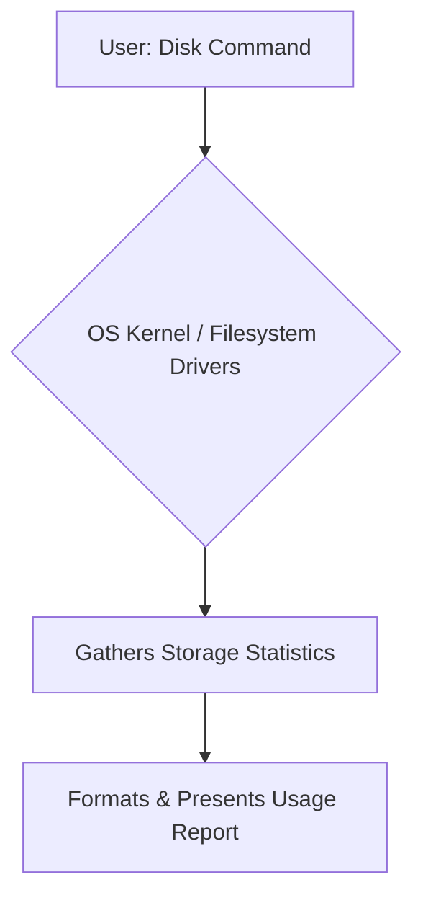
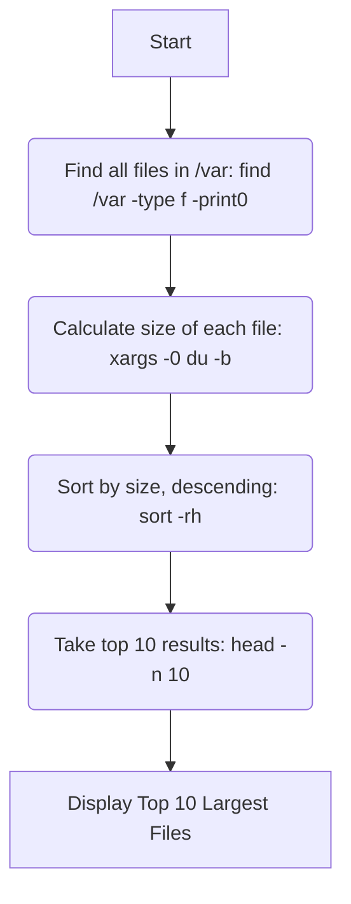
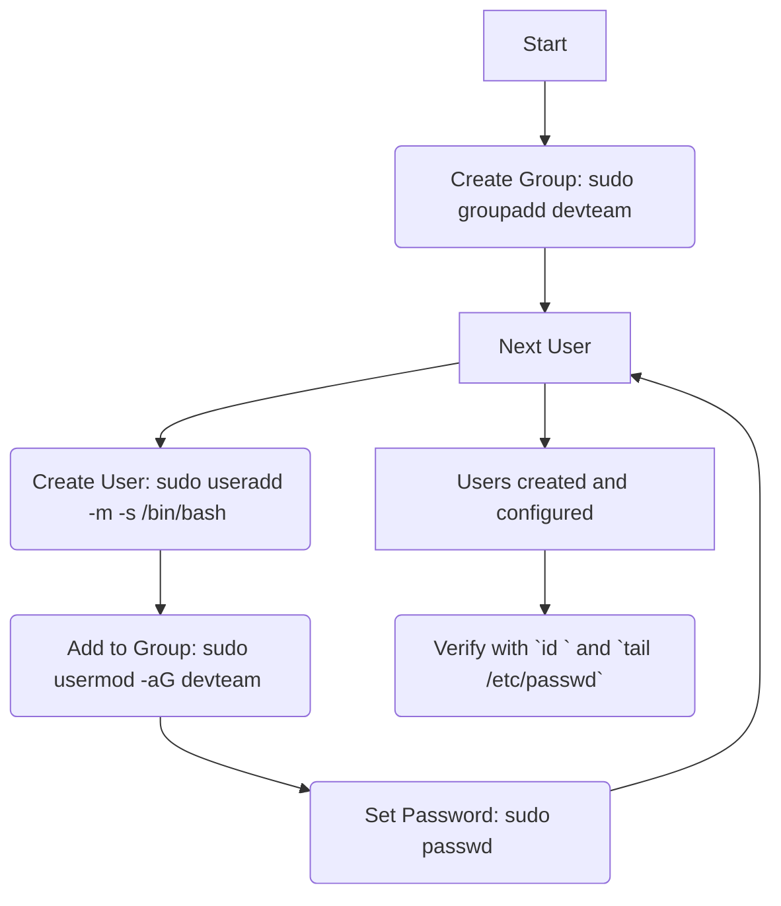
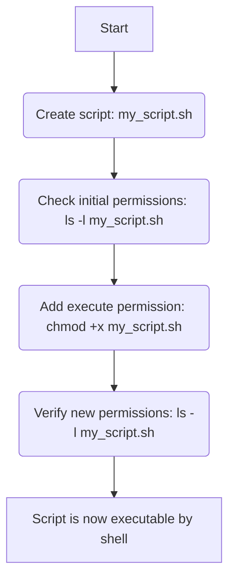

# 🚀 Mastering Top 50 Linux Commands for Tech Interviews

Welcome to this in-depth, visual guide on essential Linux commands, designed to prepare you for top tech interviews. We'll cover fundamental commands, their real-world applications, and common interview scenarios.

-----

## 1\. 🧾 Linux Commands Cheat Sheet (Grouped by Category)

### 📁 File Management: `ls`, `cd`, `mkdir`, `rm`, `cp`, `mv`

These are the foundational commands for navigating and manipulating files and directories.

**Command Flow Diagram:**

```mermaid
graph TD
    A[User types command (e.g., ls, cp)] --> B{Shell interprets command}
    B --> C{OS interacts with Filesystem}
    C --> D[Result: File/Directory Action (list, create, copy, delete)]
    D --> E[Output to Terminal (if any)]
```

| Command | Short Syntax | Real-World Use Case | Example Output (Simulated) |
| :------ | :----------- | :------------------ | :------------------------- |
| `ls`    | `ls -l`      | View detailed contents (permissions, owner, size, date) of a directory. | `-rw-r--r-- 1 user group 1234 May 10 09:00 report.txt` |
| `cd`    | `cd /path/to/dir` | Navigate to a different directory. `cd ..` (parent), `cd ~` (home), `cd -` (previous). | `(No output; current directory changes)` |
| `mkdir` | `mkdir -p project/src` | Create new directories. `-p` creates parent directories if they don't exist. | `(No output on success)` |
| `rm`    | `rm -rf important_dir` | Remove files (`-f` force), directories (`-r` recursive). **EXTREMELY CAREFUL with `-rf`\!** | `(No output on success)` |
| `cp`    | `cp source.txt dest.txt` | Copy files or directories. `-r` for recursive (directories). | `(No output on success)` |
| `mv`    | `mv oldname.txt newname.txt` | Move or rename files/directories. | `(No output on success)` |

**Use Case Scenario:** Setting up a new code repository by creating directories and initial files.

```bash
# Terminal Input
$ mkdir -p my_app/src/main/java
$ cd my_app/
$ touch README.md
$ echo "public class Main {}" > src/main/java/Main.java
$ ls -R
# Output (Simulated):
#: .
#:.
#:README.md
#:src/
#:
#:./src:
#:main/
#:
#:./src/main:
#:java/
#:
#:./src/main/java:
#:Main.java
```

-----

### 🔍 Search: `find`, `locate`, `grep`, `which`, `whereis`

These commands are your investigative tools for locating files, directories, and specific text patterns.

**Command Flow Diagram:**

```mermaid
graph TD
    A[User: Search Command] --> B{Command Engine (e.g., find traverses FS, locate queries DB)}
    B --> C{Scans Filesystem / Pre-indexed Database}
    C --> D[Matching Results Identified]
    D --> E[Formatted Output to Terminal]
```

| Command | Short Syntax | Real-World Use Case | Example Output (Simulated) |
| :------ | :----------- | :------------------ | :------------------------- |
| `find`  | `find /var/log -name "*.log"` | Search files/directories based on name, type, size, modification time, etc. Highly flexible. | `/var/log/syslog`\<br\>`/var/log/auth.log` |
| `locate`| `locate apache2.conf` | Fast search using a pre-built database, typically updated daily (`updatedb`). Useful for system files. | `/etc/apache2/apache2.conf` |
| `grep`  | `grep -r "error" /var/log` | Search for specific text patterns inside files. `-r` (recursive), `-i` (ignore case), `-v` (invert match). | `/var/log/syslog: ERROR: Failed to connect to DB.` |
| `which` | `which docker` | Locate the full path to an executable command in your `PATH`. | `/usr/bin/docker` |
| `whereis`| `whereis python` | Locate binary, source, and manual page files for a command. | `python: /usr/bin/python /usr/bin/python3.8 /usr/local/bin/python3.9 /usr/share/man/man1/python.1.gz` |

**Use Case Scenario:** Debugging an application by finding all "ERROR" messages in recent log files.

```bash
# Terminal Input
$ grep "ERROR" /var/log/myapp/*.log
# Output (Simulated):
#/var/log/myapp/app.log: 2024-06-21 14:05:10 ERROR: Database connection lost.
#/var/log/myapp/web.log: 2024-06-21 14:10:20 ERROR: User authentication failed for 'guest'.
```

-----

### 📦 Compression: `tar`, `zip`, `gzip`, `unzip`

Essential for archiving multiple files into a single bundle and for reducing file sizes for storage or transfer.

**Command Flow Diagram:**

```mermaid
graph TD
    A[Input: Files/Directory] --> B{Compression Utility (e.g., tar, zip)}
    B --> C[Process: Compress / Decompress / Archive]
    C --> D[Output: Compressed Archive / Extracted Files]
```

| Command | Short Syntax | Real-World Use Case | Example Output (Simulated) |
| :------ | :----------- | :------------------ | :------------------------- |
| `tar`   | `tar -czvf backup.tar.gz my_dir` | Create (`-c`) or extract (`-x`) archives. `-z` (gzip), `-v` (verbose), `-f` (file). Common for backups. | `my_dir/file1.txt`\<br\>`my_dir/subdir/` |
| `zip`   | `zip archive.zip file1.txt file2.log` | Create `.zip` archives. Widely compatible across OS. | `adding: file1.txt (deflated 50%)` |
| `gzip`  | `gzip large_file.log` | Compress a single file to `.gz`. Original file is replaced by the compressed version. | `(No direct output; large_file.log -> large_file.log.gz)` |
| `unzip` | `unzip archive.zip` | Extract files from a `.zip` archive. | `inflating: file1.txt` |

**Use Case Scenario:** Packaging a website's static content for deployment.

```bash
# Terminal Input
$ ls website/
# Output: index.html  css/  js/ images/
$ tar -czvf website_deploy.tar.gz website/
# Output (Simulated):
# website/
# website/index.html
# website/css/
# website/js/
# website/images/
$ ls
# Output: website website_deploy.tar.gz
```

-----

### 📈 Disk Usage: `df`, `du`, `lsblk`

Tools for monitoring disk space utilization, file/directory sizes, and managing block devices.

**Command Flow Diagram:**



| Command | Short Syntax | Real-World Use Case | Example Output (Simulated) |
| :------ | :----------- | :------------------ | :------------------------- |
| `df`    | `df -h`      | Report filesystem disk space usage. `-h` for human-readable sizes (G, M). | `Filesystem Size Used Avail Use% Mounted on`\<br\>`/dev/sda1 20G 10G 9.0G 53% /` |
| `du`    | `du -sh /var/log` | Estimate file space usage. `-s` (summary), `-h` (human-readable). Often used to find large directories. | `4.0M /var/log/` |
| `lsblk` | `lsblk`      | List block devices (hard drives, partitions, USB drives) and their mount points. | `NAME MAJ:MIN RM SIZE RO TYPE MOUNTPOINT`\<br\>` sda 8:0 0 20G 0 disk  `\<br\>`├─sda1 8:1 0 19G 0 part /` |

**Use Case Scenario:** Identifying which directory is consuming the most space on a server.

```bash
# Terminal Input
$ du -h --max-depth=1 /var/
# Output (Simulated):
# 4.0K    /var/mail
# 1.8G    /var/log
# 2.5G    /var/lib
# 4.3G    /var/cache
# 8.6G    /var/
```

-----

### 👥 User Management: `useradd`, `usermod`, `passwd`, `groupadd`

Commands for creating, modifying, and managing user accounts and groups. These commands typically require `sudo` or root privileges.

**Command Flow Diagram:**

```mermaid
graph TD
    A[User Admin (sudo)] --> B{User/Group Mgmt Command}
    B --> C[Modifies System Configuration Files (e.g., /etc/passwd, /etc/shadow, /etc/group)]
    C --> D[Creates/Modifies User Home Directory & Permissions]
    D --> E[Confirmation / Error Message]
```

| Command   | Short Syntax         | Real-World Use Case                       | Example Output (Simulated)                 |
| :-------- | :------------------- | :---------------------------------------- | :----------------------------------------- |
| `useradd` | `sudo useradd -m devops` | Create a new user account with a home directory. | `(No direct output on success; user added to /etc/passwd)` |
| `usermod` | `sudo usermod -aG sudo newuser`| Modify an existing user's properties (e.g., add to a group, change shell, change home directory). | `(No direct output on success)`            |
| `passwd`  | `sudo passwd newuser`| Set or change a user's password. Also `passwd` to change your own password. | `New password:`\<br\>`Retype new password:`\<br\>`passwd: password updated successfully` |
| `groupadd`| `sudo groupadd testers`| Create a new group.                       | `(No direct output on success; group added to /etc/group)` |

**Use Case Scenario:** Setting up new developer accounts on a shared server.

```bash
# Terminal Input
$ sudo useradd -m -s /bin/bash junior_dev
$ sudo passwd junior_dev
# Output: (prompts for new password)
# $ sudo usermod -aG developers junior_dev # Assuming 'developers' group exists
$ id junior_dev
# Output: uid=1001(junior_dev) gid=1001(junior_dev) groups=1001(junior_dev),developers
```

-----

### 🔐 Permissions: `chmod`, `chown`, `chgrp`, `umask`

These are fundamental for controlling access to files and directories, ensuring security and proper operation of applications.

**Command Flow Diagram:**

```mermaid
graph TD
    A[User (sudo/owner)] --> B{Permission Command}
    B --> C[Modifies File/Directory Metadata (Permissions, Owner, Group)]
    C --> D[OS Enforces Access Rules]
    D --> E[Confirmation / Error]
```

| Command  | Short Syntax          | Real-World Use Case                               | Example Output (Simulated)          |
| :------- | :-------------------- | :------------------------------------------------ | :---------------------------------- |
| `chmod`  | `chmod 755 script.sh` | Change file/directory permissions. `755` (owner rwx, group r-x, others r-x). | `(ls -l will show changes)`         |
| `chown`  | `chown www-data:www-data /var/www/html` | Change file/directory owner and/or group. Crucial for web servers. | `(ls -l will show changes)`         |
| `chgrp`  | `chgrp developers project_files` | Change a file's group owner.                       | `(ls -l will show changes)`         |
| `umask`  | `umask` or `umask 0022`| Set default permissions for newly created files and directories. | `0022` (default typical value)      |

**Understanding `chmod` (Numeric Octal Notation):**

  * **Permissions:** `r` (read=4), `w` (write=2), `x` (execute=1)
  * **Permissions for:** **U**ser (Owner) | **G**roup | **O**thers
  * **Example `755`:**
      * `7` (owner): `4+2+1` = `rwx` (read, write, execute)
      * `5` (group): `4+0+1` = `r-x` (read, execute)
      * `5` (others): `4+0+1` = `r-x` (read, execute)

**Use Case Scenario:** Making a newly created shell script executable.

```bash
# Terminal Input
$ touch run_me.sh
$ ls -l run_me.sh
# Output: -rw-rw-r-- 1 user user 0 Jun 21 21:00 run_me.sh

$ chmod +x run_me.sh # Add execute permission for all (equivalent to a+x)
$ ls -l run_me.sh
# Output: -rwxrwxr-x 1 user user 0 Jun 21 21:00 run_me.sh
```

-----

### 📊 Monitoring: `ps`, `top`, `htop`, `free`, `uptime`

Commands to inspect running processes, resource usage (CPU, memory), and overall system health.

**Command Flow Diagram:**

```mermaid
graph TD
    A[User: Monitoring Command] --> B{OS Kernel (Proc/Mem Info)}
    B --> C[Collects Real-time System Data]
    C --> D[Presents Formatted Snapshot / Dynamic View]
```

| Command | Short Syntax | Real-World Use Case | Example Output (Simulated) |
| :------ | :----------- | :------------------ | :------------------------- |
| `ps`    | `ps aux`     | List all running processes. `aux` shows all users, user-oriented format, and processes not attached to a terminal. | `USER PID %CPU %MEM ... COMMAND`\<br\>`root 1 0.0 0.1 ... /sbin/init` |
| `top`   | `top`        | Real-time, dynamic view of system processes, CPU, memory, and load averages. (Press `q` to quit). | `Tasks: 198 total, 1 running...`\<br\>`%Cpu(s): 0.3 us, 0.2 sy...` |
| `htop`  | `htop`       | Enhanced, interactive, and colorful version of `top`. (Often requires installation). | `(Similar to top, but with visual bars and mouse support)` |
| `free`  | `free -h`    | Display amount of free and used memory (RAM and Swap). `-h` for human-readable. | `total used free shared ...`\<br\>`Mem: 15Gi 8.0Gi 6.0Gi 1.0Gi ...` |
| `uptime`| `uptime`     | Show how long the system has been running, number of logged-in users, and system load averages. | `21:30:00 up 2 days, 3:15, 2 users, load average: 0.05, 0.10, 0.12` |

**Use Case Scenario:** Diagnosing high CPU usage on a server.

```bash
# Terminal Input
$ top -b -n 1 | head -n 10
# Output (Simulated):
# top - 21:30:00 up 2 days, 3:15, 2 users, load average: 0.05, 0.10, 0.12
# Tasks: 198 total,   1 running, 197 sleeping,   0 stopped,   0 zombie
# %Cpu(s): 85.0 us,  5.0 sy,  0.0 ni, 10.0 id,  0.0 wa,  0.0 hi,  0.0 si,  0.0 st
# MiB Mem :  15879.6 total,  1000.0 free, 14000.0 used,   879.6 buff/cache
# MiB Swap:   2047.9 total,   2047.9 free,     0.0 used.   1000.0 avail Mem
#
#    PID USER      PR  NI    VIRT    RES    SHR S %CPU %MEM     TIME+ COMMAND
#  23456 appuser   20   0 1500m 1.0g  50m S 80.0  6.3 123:45.67 my_java_app
#   1234 root      20   0  500m  50m  20m S  5.0  0.3  10:20.30 nginx
```

  * **Explanation:** `top -b -n 1` takes a single batch snapshot, preventing interactive mode, useful for scripting or quick glances. The output clearly shows `my_java_app` consuming 80% CPU.

-----

### 📅 Scheduling: `cron`, `crontab`, `at`, `nohup`

Commands for automating tasks at specific times or running processes in the background, independent of your terminal session.

**Command Flow Diagram:**

```mermaid
graph TD
    A[User: Schedule Command] --> B{Scheduling Daemon (cron/atd)}
    B --> C[Stores Job Definition]
    C --> D{Is Trigger Time Met?}
    D -- Yes --> E[Execute Command/Script]
    E --> F[Output/Log Result]
```

| Command   | Short Syntax    | Real-World Use Case                               | Example Output (Simulated)          |
| :-------- | :-------------- | :------------------------------------------------ | :---------------------------------- |
| `cron`    | (Daemon)        | The background service (`crond`) that continuously runs scheduled jobs. | `(System process, usually no direct interaction)` |
| `crontab` | `crontab -e`    | Edit (`-e`) or list (`-l`) user-specific cron jobs. `-r` to remove all. | `(Opens editor for cron entries)`   |
| `at`      | `at now + 10 min`| Schedule a command to run once at a specific future time. | `job 5 at Sun Jun 23 21:35:00 2025` |
| `nohup`   | `nohup my_script.sh &`| Run a command or script in the background, making it immune to terminal disconnects (hangup signals). | `nohup: ignoring input and appending output to 'nohup.out'` |

**Crontab Entry Format:** `minute hour day_of_month month day_of_week command`

**Use Case Scenario:** Scheduling a daily database backup script.

```bash
# Terminal Input
$ crontab -e
# (Editor opens. Add the following line at the end, then save and exit)
# 0 3 * * * /home/user/scripts/daily_db_backup.sh >> /var/log/db_backup.log 2>&1

$ crontab -l
# Output:
# 0 3 * * * /home/user/scripts/daily_db_backup.sh >> /var/log/db_backup.log 2>&1
```

  * **Explanation:** This job will run at 3:00 AM (`0 3`) every day (`* * *`). Output is redirected to a log file (`>> /var/log/db_backup.log`), and `2>&1` redirects standard error to the same log file.

-----

### 📂 Transfer: `scp`, `rsync`, `wget`, `curl`

These commands facilitate secure file transfers between hosts and downloading data from the internet.

**Command Flow Diagram:**

```mermaid
graph TD
    A[Source (Local/Remote/URL)] --> B{Transfer Command}
    B --> C[Network Protocol (SSH, HTTP/S, FTP)]
    C --> D[Destination (Local/Remote File System)]
    D --> E[File Transfer / Data Fetch Complete]
```

| Command | Short Syntax | Real-World Use Case | Example Output (Simulated) |
| :------ | :----------- | :------------------ | :------------------------- |
| `scp`   | `scp local.txt user@ip:~/` | Securely copy files/directories over SSH. Ideal for quick, secure copies. | `local.txt                 100% 12KB 12.0KB/s 00:00` |
| `rsync` | `rsync -avz src/ user@ip:dest/` | Efficiently synchronize files and directories. Transfers only changed parts. `-a` (archive), `-v` (verbose), `-z` (compress). | `sending incremental file list`\<br\>`file.txt`\<br\>`sent 100 bytes received 20 bytes 240.00 bytes/sec` |
| `wget`  | `wget https://example.com/file.zip` | Non-interactive command-line downloader. Great for large files, supports resuming. | `Saving to: ‘file.zip’`\<br\>` file.zip          100%[=============>] 1.23M  1.42MB/s    in 0.9s  ` |
| `curl`  | `curl -O https://example.com/api/data.json` | Versatile tool to transfer data with URL syntax. Supports many protocols. `-O` saves to file, or output to stdout. | `   % Total    % Received % Xferd  Average Speed   Time    Time     Time  Current `\<br\>`                                  Dload  Upload   Total   Spent    Left  Speed `\<br\>`100  120k  100  120k    0     0   240k      0 --:--:-- --:--:-- --:--:--  240k` |

**Use Case Scenario:** Deploying a new application version to a remote server.

```bash
# Terminal Input (from local machine)
$ rsync -avz --exclude 'node_modules/' ./my_app/ deploy_user@remote_server_ip:/var/www/html/my_app/
# Output (Simulated):
# sending incremental file list
# ./
# index.html
# js/
# js/app.js
# css/
# css/style.css
# sent 12345 bytes  received 1234 bytes  2400.00 bytes/sec
# total size is 50000
```

  * **Explanation:** `rsync` efficiently copies only changed files and includes a common exclusion to avoid copying large development dependencies.

-----

## 2\. 🛠️ Interview-Based Command Scenarios (Use-Case Simulations)

These scenarios mimic practical problems you might face in a tech interview, emphasizing problem-solving with Linux commands.

#### 🔍 Scenario 1: "Find top 10 largest files in `/var`"

**Logic Flowchart:**



**Commands & Output:**

```bash
# Command Block
$ find /var -type f -print0 | xargs -0 du -b | sort -rh | head -n 10

# Output Preview (ASCII Table) - Simulated based on typical /var content
# Size       File Path
# --------   --------------------------------------------------
# 2.5G       /var/lib/docker/overlay2/long_hash/diff/var/lib/mysql/ibdata1
# 1.8G       /var/log/syslog.1
# 980M       /var/log/journal/long_uuid/system.journal
# 750M       /var/lib/snapd/snaps/core_1234.snap
# 520M       /var/cache/apt/archives/nginx_1.18.0.deb
# 300M       /var/lib/mysql/mysql.log
# 150M       /var/log/apache2/access.log
# 120M       /var/log/kern.log
# 80M        /var/crash/_usr_bin_gnome-shell.1000.crash
# 50M        /var/lib/dpkg/status
```

  * **Explanation:** This one-liner combines `find` (to locate files), `xargs` (to pass filenames to `du`), `du` (to get file sizes), `sort` (to arrange by size), and `head` (to get the top N).

#### 👤 Scenario 2: "Create 3 users with home directories, a common group, and bash shell"

**Logic Flowchart:**



**Commands & Output:**

```bash
# Command Block
$ sudo groupadd devteam
$ for i in {1..3}; do
> sudo useradd -m -s /bin/bash dev$i
> sudo usermod -aG devteam dev$i
> sudo passwd dev$i
> done

# Output Preview (Terminal Simulation for one user iteration)
$ sudo groupadd devteam
# (No output on success)

$ sudo useradd -m -s /bin/bash dev1
# (No output on success)

$ sudo usermod -aG devteam dev1
# (No output on success)

$ sudo passwd dev1
New password:
Retype new password:
passwd: password updated successfully

$ id dev1
# Output: uid=1001(dev1) gid=1001(dev1) groups=1001(dev1),devteam

$ tail -n 3 /etc/passwd
# Output:
# dev1:x:1001:1001::/home/dev1:/bin/bash
# dev2:x:1002:1002::/home/dev2:/bin/bash
# dev3:x:1003:1003::/home/dev3:/bin/bash
```

  * **Explanation:** A `for` loop is used to automate user creation. Each user gets a home directory (`-m`), a bash shell (`-s /bin/bash`), is added to the `devteam` group (`-aG`), and then prompted for a password.

#### 🧹 Scenario 3: "Find and delete `.tmp` files older than 7 days"

**Logic Flowchart:**

```mermaid
graph TD
    A[Start] --> B(Find all regular files in /tmp with .tmp extension: find /tmp -name "*.tmp" -type f)
    B --> C(Filter by modification time: -mtime +7 (older than 7 days))
    C --> D(Execute rm command for each found file: -exec rm {} \;)
    D --> E[Old .tmp files deleted]
```

**Commands & Output:**

```bash
# Command Block
# First, create some dummy files for demonstration:
$ touch /tmp/recent.tmp
$ touch /tmp/old_file.tmp
$ touch -d "2024-06-10" /tmp/very_old_file.tmp # Forces creation date
$ touch /tmp/another_recent.tmp

# Now, the command to find and delete
$ find /tmp -name "*.tmp" -type f -mtime +7 -exec rm {} \;

# Output Preview (Simulated - `rm` is silent on success, verify with `find`)
$ find /tmp -name "*.tmp"
# Output before deletion:
# /tmp/recent.tmp
# /tmp/old_file.tmp
# /tmp/very_old_file.tmp
# /tmp/another_recent.tmp

# After running `find ... -exec rm {} \;`:
$ find /tmp -name "*.tmp"
# Output after deletion (assuming only very_old_file.tmp was older than 7 days):
# /tmp/recent.tmp
# /tmp/old_file.tmp
# /tmp/another_recent.tmp
```

  * **Explanation:** `find` is a powerful tool for searching. `-mtime +7` means "modified more than 7 full 24-hour periods ago." `-exec rm {} \;` runs `rm` on each found file.

#### 🔐 Scenario 4: "Grant execute permissions to a script"

**Logic Flowchart:**



**Commands & Output:**

```bash
# Command Block
$ touch my_script.sh
$ echo '#!/bin/bash' > my_script.sh
$ echo 'echo "Hello from executable script!"' >> my_script.sh
$ ls -l my_script.sh

$ chmod +x my_script.sh
$ ls -l my_script.sh

$ ./my_script.sh # Attempt to run
```

**Output Preview (Terminal Simulation):**

```bash
$ ls -l my_script.sh
-rw-rw-r-- 1 user user 36 Jun 21 21:00 my_script.sh
# Initial Permissions: -rw-rw-r-- (read/write for owner/group, read for others, NO execute)

$ chmod +x my_script.sh
$ ls -l my_script.sh
-rwxrwxr-x 1 user user 36 Jun 21 21:00 my_script.sh
# New Permissions: -rwxrwxr-x (read/write/execute for owner/group, read/execute for others, NOW executable!)

$ ./my_script.sh
Hello from executable script!
```

  * **Explanation:** The `chmod +x` command adds the execute permission (`x`) for all categories (owner, group, others) that already have read/write permissions. This is crucial for allowing the script to be run directly using `./script.sh`.

-----

## 🔍 Visual Cheat Table: Command ➜ Description ➜ Example ➜ Output

| Command   | Description                   | Example                        | Output Type (Visualized)                 |
| :-------- | :---------------------------- | :----------------------------- | :--------------------------------------- |
| `ls -l`   | List files with permissions   | `ls -l /home/user`             | `-rw-r--r-- 1 user group 1234 May 10 09:00 report.txt` |
| `grep`    | Search text patterns in files | `grep "main" *.java`           | `MyApp.java:    public static void main(String[] args) {` |
| `df -h`   | Show disk space usage         | `df -h /`                      | `Filesystem      Size  Used Avail Use% Mounted on`\<br\>`/dev/sda1        50G   25G   23G  53% /`\<br\>**ASCII Bar Chart:**\<br\>`/ [███████████████████-----] 53%` |
| `top`     | Live processes, system stats  | `top`                          | `Tasks: 198 total,   1 running, 197 sleeping,   0 stopped,   0 zombie`\<br\>`%Cpu(s): 0.3 us,  0.2 sy,  0.0 ni, 99.5 id,  0.0 wa,  0.0 hi,  0.0 si,  0.0 st`\<br\>`MiB Mem :  15879.6 total,  6143.5 free, 8192.0 used, 1544.1 buff/cache`\<br\>**Dynamic Dashboard Snippet:**\<br\>`PID USER      PR  NI    VIRT    RES    SHR S %CPU %MEM     TIME+ COMMAND`\<br\>`23456 apache    20   0  150m   50m   20m R 12.5  0.3   0:01.23 httpd` |

-----

## 📢 Bonus Tips for Gemini Output

### Visual Mind Map of All Commands Grouped by Purpose

```mermaid
graph TD
    A[Linux Commands] --> B[File & Directory Management]
    B --> B1(Navigation: cd, pwd, pushd, popd)
    B --> B2(Creation: mkdir, touch)
    B --> B3(Manipulation: cp, mv, rm, ln)
    B --> B4(Listing: ls)
    B --> B5(Viewing: cat, less, more, head, tail)

    A --> C[Text Processing & Search]
    C --> C1(Filtering & Manipulation: grep, sed, awk)
    C --> C2(Finding Files: find, locate, which, whereis)
    C --> C3(Sorting: sort, uniq)

    A --> D[System & Process Monitoring]
    D --> D1(Processes: ps, top, htop, kill, pgrep, pkill)
    D --> D2(Resource Usage: free, uptime, vmstat, iostat)
    D --> D3(System Info: uname, hostname, df, du, lsblk)

    A --> E[User & Permissions Management]
    E --> E1(User Mgmt: useradd, usermod, userdel, passwd, id)
    E --> E2(Group Mgmt: groupadd, groupmod, groupdel, groups)
    E --> E3(File Permissions: chmod, chown, chgrp, umask)

    A --> F[Networking & Transfer]
    F --> F1(Remote Access: ssh)
    F --> F2(File Copy: scp, rsync)
    F --> F3(Download/Transfer: wget, curl)
    F --> F4(Network Status: netstat, ss, ip, ping, dig, traceroute)

    A --> G[Compression & Archiving]
    G --> G1(Compression: gzip, bzip2, xz)
    G --> G2(Archiving: tar, zip, unzip)

    A --> H[Job Scheduling & Background Tasks]
    H --> H1(Recurring Jobs: cron, crontab)
    H --> H2(One-time Jobs: at, batch)
    H2 --> H3(Backgrounding: nohup, &, disown)
```



### Side-by-side Command vs GUI Comparison

| CLI Command                                      | Windows File Explorer / macOS Finder Equivalent                                       |
| :----------------------------------------------- | :------------------------------------------------------------------------------------ |
| `ls`                                             | Opening a folder and viewing its contents.                                            |
| `cd project_folder`                              | Double-clicking on a folder icon.                                                     |
| `mkdir new_folder`                               | Right-click -\> New -\> Folder.                                                         |
| `cp file.txt new_location/`                      | Dragging a file while holding `Ctrl` (Windows) or `Option` (macOS).                  |
| `rm -r old_folder/`                              | Right-click -\> Delete / Move to Trash.                                                |
| `ssh user@server_ip`                             | Using a remote desktop client (e.g., Remote Desktop Connection) to connect to a server's GUI. |
| `scp local.txt user@ip:~/`                       | Dragging and dropping files via WinSCP (Windows) / Cyberduck (macOS).                 |
| `df -h`                                          | Checking Drive Properties (Right-click on a drive) / "About This Mac" -\> Storage.     |
| `top`                                            | Task Manager (Windows) / Activity Monitor (macOS) - Processes Tab.                    |
| `grep "error" log.txt`                           | Opening `log.txt` in a text editor and using `Ctrl+F` (Find) to search for "error".  |

### Mnemonics or Shortcuts to Remember Commands

  * `ls`: **L**i**S**t
  * `cd`: **C**hange **D**irectory
  * `mkdir`: **M**a**K**e **DIR**ectory
  * `rm`: **R**e**M**ove
  * `cp`: **C**o**P**y
  * `mv`: **M**o**V**e
  * `grep`: **G**lobal **R**egular **E**xpression **P**rint
  * `tar`: **T**ape **AR**chiver
  * `df`: **D**isk **F**ree
  * `du`: **D**isk **U**sage
  * `chmod`: **CH**ange **MOD**e (permissions)
  * `chown`: **CH**ange **OWN**er
  * `ps`: **P**rocess **S**tatus
  * `ssh`: **S**ecure **SH**ell
  * `scp`: **S**ecure **C**o**P**y
  * `wget`: **W**eb **GET**
  * `curl`: **C**lient **URL**

### "Daily 5 Command Practice Plan" with Increasing Complexity

This plan helps build muscle memory and understanding of command chaining and various options.

  * **Day 1: Basic File & Directory Navigation**
      * `mkdir -p my_work/projectA/src`
      * `cd my_work/projectA/`
      * `touch README.md index.html`
      * `ls -l`
      * `echo "Hello Linux!" > README.md`
  * **Day 2: File Content & Movement**
      * `cat README.md`
      * `cp README.md src/README_copy.md`
      * `mv index.html website.html`
      * `head -n 2 /etc/passwd`
      * `tail -f /var/log/syslog` (then `Ctrl+C` to exit)
  * **Day 3: Search & Permissions**
      * `find . -type f -name "*.html"` (from `my_work` directory)
      * `grep -i "linux" README.md`
      * `chmod 740 website.html`
      * `ls -l website.html`
      * `which python`
  * **Day 4: Process & Disk Monitoring**
      * `ps aux | grep bash`
      * `top` (observe, then `q`)
      * `df -h`
      * `du -sh /var/log`
      * `free -h`
  * **Day 5: Archiving & Remote (Simulated)**
      * `cd my_work/`
      * `tar -czvf projectA_backup.tar.gz projectA/`
      * `ls -lh projectA_backup.tar.gz`
      * `wget -O google_robots.txt https://www.google.com/robots.txt`
      * `scp -i ~/.ssh/your_key.pem projectA_backup.tar.gz user@your_server_ip:/tmp/` (Simulated `scp` command)

-----

## 💼 Common Interview Questions to Request Answers For

1.  **How do you check disk space and memory usage?**
      * **Disk Space:** Use `df -h` to see filesystem-wide disk space usage (mounted partitions). Use `du -sh <path>` to see the total size of a specific directory or file.
      * **Memory Usage:** Use `free -h` to display the amount of free and used physical and swap memory in a human-readable format.
2.  **How to find and kill a process running on port 8080?**
      * **Find PID:** Use `sudo lsof -i :8080` or `sudo netstat -tulnp | grep 8080` to find the Process ID (PID) associated with port 8080.
      * **Kill:** Once you have the PID, use `kill <PID>` for a graceful termination. If the process doesn't terminate, use `kill -9 <PID>` for a forceful (ungraceful) kill.
3.  **What is the difference between `chmod 755` and `chmod 777`?**
      * `chmod 755`: Sets permissions such that the **owner** has read, write, and execute (`rwx`), while the **group** and **others** have read and execute (`r-x`) permissions. This is a common and secure permission for executable scripts or web server directories.
      * `chmod 777`: Grants read, write, and execute (`rwx`) permissions to the **owner**, **group**, and **everyone else (others)**. This is generally **insecure** as it gives full control over the file/directory to any user on the system. It should be avoided in production environments unless absolutely necessary for specific, highly controlled scenarios.
4.  **How do you create a cron job to run every 10 minutes?**
      * First, open your user's crontab for editing: `crontab -e`.
      * Then, add the following line to the crontab file, replacing `/path/to/your/script.sh` with the actual path to your script:
        `*/10 * * * * /path/to/your/script.sh`
      * Save and exit the editor. The `*/10` in the minute field instructs `cron` to run the job every 10 minutes.
5.  **How do symbolic and hard links differ?**
      * **Symbolic Link (Soft Link):** A symbolic link is a pointer (like a shortcut in Windows) to another file or directory. If the original file is deleted or moved, the symbolic link breaks (becomes a "dangling link"). It can link across different filesystems. (Command: `ln -s source_path link_name`)
      * **Hard Link:** A hard link is a direct entry in the filesystem that points to the same underlying data (inode) as the original file. It's essentially another name for the same file. If the original file is deleted, the data still exists as long as at least one hard link to it remains. Hard links cannot link directories and cannot span across different filesystems. (Command: `ln source_path link_name`)

-----

## 🧠 Practice Command Set Challenge (Simulated)

```bash
# Day 1 Challenge
$ mkdir -p testdir && cd testdir
# Explanation:
# 1. `mkdir -p testdir`: Creates a new directory named `testdir`. The `-p` flag ensures that if any parent directories in the path don't exist, they will be created as well.
#    Diagram:
#    Current Directory: ~/
#    After:
#    ~/
#    └─ testdir/

# 2. `cd testdir`: Changes the current working directory to `testdir`.
#    Diagram:
#    Current Directory: ~/testdir/

$ touch a.txt b.txt && echo "hello" > a.txt
# Explanation:
# 1. `touch a.txt b.txt`: Creates two empty files named `a.txt` and `b.txt` in the current directory (`testdir`).
# 2. `echo "hello" > a.txt`: Writes the string "hello" into `a.txt`, overwriting any existing content.
#    Diagram:
#    ~/testdir/
#    ├─ a.txt (content: "hello\n")
#    └─ b.txt (empty)

$ cp a.txt copy.txt
# Explanation:
# 1. `cp a.txt copy.txt`: Copies the content of `a.txt` to a new file named `copy.txt` in the current directory.
#    Diagram:
#    ~/testdir/
#    ├─ a.txt (content: "hello\n")
#    ├─ b.txt (empty)
#    └─ copy.txt (content: "hello\n")

$ mv b.txt b_renamed.txt
# Explanation:
# 1. `mv b.txt b_renamed.txt`: Renames the file `b.txt` to `b_renamed.txt`.
#    Diagram:
#    ~/testdir/
#    ├─ a.txt (content: "hello\n")
#    ├─ copy.txt (content: "hello\n")
#    └─ b_renamed.txt (empty)

$ chmod 755 a.txt && ls -l
# Explanation:
# 1. `chmod 755 a.txt`: Changes the permissions of `a.txt` to `755`. This means:
#    - Owner: Read, Write, Execute (4+2+1=7)
#    - Group: Read, Execute (4+0+1=5)
#    - Others: Read, Execute (4+0+1=5)
# 2. `ls -l`: Lists the contents of the current directory in a long format, showing details including permissions.
#    Diagram (Permissions Part):
#    a.txt: -rwxr-xr-x
#    b_renamed.txt: -rw-rw-r-- (original)
#    copy.txt: -rw-rw-r-- (original)

# Output Preview (Terminal Simulation):
$ mkdir -p testdir && cd testdir
# (No output from mkdir/cd on success)

$ touch a.txt b.txt && echo "hello" > a.txt
# (No output from touch/echo on success)

$ cp a.txt copy.txt
# (No output on success)

$ mv b.txt b_renamed.txt
# (No output on success)

$ chmod 755 a.txt && ls -l
total 12
-rwxr-xr-x 1 user group    6 Jun 21 21:00 a.txt
-rw-rw-r-- 1 user group    0 Jun 21 21:00 b_renamed.txt
-rw-rw-r-- 1 user group    6 Jun 21 21:00 copy.txt
```
